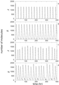
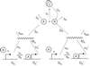
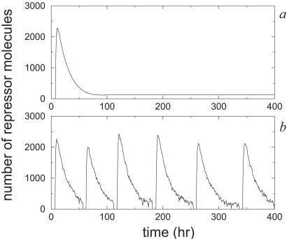

# Modeling the Circadian Clock: Deterministic and Stochastic Simulation

Link to article: https://pubmed.ncbi.nlm.nih.gov/11972055/

### Project overview: 

This project explores reproducibility in scientific computing by replicating results from a well-known article in systems biology. The focus is on modeling a simplified circadian clock using both:

Deterministic ODEs
Stochastic simulations (SSA)

The aim is not to fully master the biological details, but to reproduce key figures and gain insight into how noise influences biological rhythms.

Circadian clocks help organisms adapt to daily cycles such as light and darkness. They work through feedback loops where:

An activator protein (A) promotes the expression of a repressor.
The repressor protein (R) then inhibits the activator.
The cycle restarts when the repressor degrades, allowing the activator to be expressed again.

In this project, we study a simplified circadian clock model from Vilar et al. (2002) that includes two proteins (A and R) and their corresponding genes.

**Assignment A – Deterministic Model**

Task: Reproduce Figures 2a and 2b from Vilar et al. (2002).

 

Method:
Solve the ODE system from Eq. [1] in the article (stiff system).

 

Use scipy.integrate.solve_ivp with the BDF( (Backward Differentiation Formula) solver.
Apply the parameters and initial values given in Fig. 1 (article).
Simulate the system over 400 hours.
Plot the concentrations of the two proteins: A (activator) and R (repressor).

Goal: Show how A and R vary over time in the deterministic model.

**Assignment B - Stochastic Model**

Task
Reproduce Figures 2c and 2d from Vilar et al. (2002) by simulating the circadian clock with a stochastic model.

Method
Model the system as a discrete Markov process with 16 reactions (given in the article).
Use the Stochastic Simulation Algorithm (SSA) to track molecule counts over 400 hours.
Apply the same parameter values as in Assignment A (deterministic case).

**Reaction network**

- $A + R \xrightarrow{\gamma_C} C$
- $A \xrightarrow{\delta_A} \varnothing$
- $C \xrightarrow{\delta_A} R$
- $R \xrightarrow{\delta_R} \varnothing$

- $D_A + A \xrightarrow{\gamma_A} D'_A$
- $D_R + A \xrightarrow{\gamma_R} D'_R$

- $D'_A \xrightarrow{\theta_A} A + D_A$
- $D'_R \xrightarrow{\theta_R} A + D_R$

- $D_A \xrightarrow{\alpha_A} D_A + M_A$
- $D'_A \xrightarrow{\alpha'_A} D'_A + M_A$
- $M_A \xrightarrow{\delta_{M_A}} \varnothing$
- $M_A \xrightarrow{\beta_A} A + M_A$

- $D_R \xrightarrow{\alpha_R} D_R + M_R$
- $D'_R \xrightarrow{\alpha'_R} D'_R + M_R$
- $M_R \xrightarrow{\delta_{M_R}} \varnothing$
- $M_R \xrightarrow{\beta_R} M_R + R$

Goals
Plot the dynamics of A (activator) and R (repressor) over time.
Run the simulation multiple times to observe variability caused by randomness.
Compare results to the deterministic ODE model (Assignment A).

**Assignement C - Choice of method**

Task
Reproduce Figure 5 from Vilar et al. (2002), illustrating how random noise in the stochastic model can lead to qualitative differences compared to the deterministic model.

 

Method
Simulate both the deterministic ODE model and the stochastic SSA model.
Use the same parameters as before.
Compare the long-term dynamics of activator (A) and repressor (R).

Goals
Show how noise can alter system behavior compared to the smooth deterministic solution.
Highlight the divergence between models over time

